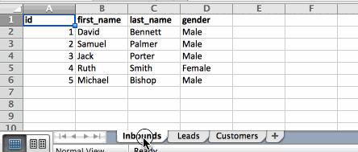
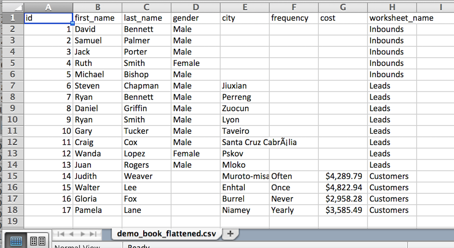

# plancha
A node CLI tool to flatten multi-sheet/tab spreadsheet files. Named for the inimitable tortilla press.

It'll turn this:

. . . into this:

## Installation

`npm install plancha -g`

## Usage

`plancha -i <input .xlsx file>`

### Arguments

* `-i, --input` (_REQUIRED_) Input filename/path of `.xlsx` file to be flattened.
* `-o, --output` (_OPTIONAL_) Output filename. If not specified, this will default to the input filename with a `_flattened` suffix.

### Notes

- This will flatten any hidden sheets along with the visible ones, so be sure you want those included.
- The assumption that launched this tool is that headers across individual sheets are at least _similar/comparable_ to each other; doublecheck that you're not flattening a table that shouldn't be flattened.

## License

MIT